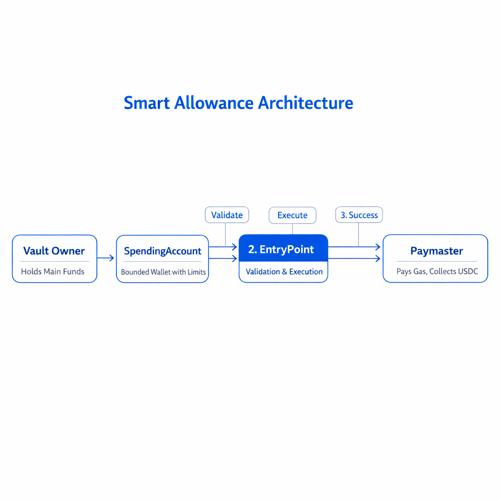

> **⚠️ WARNING: The contracts have not been audited and may contain bugs or vulnerabilities.**

Most crypto wallets give **one key full control over all funds**, so if that key is stolen or a mistake is made, **everything can be lost at once**, which makes people afraid to use crypto for everyday spending.


This code solves that by creating a **separate spending wallet with hard, on-chain daily and monthly limits**, so even if the spending wallet is compromised, **the maximum possible loss is strictly capped** and the main vault remains safe.
It also enforces these limits **before execution and gas payment**, ensuring no transaction can bypass the protections or silently drain funds.

## Setup

```bash
npm install
forge build
forge test
```

Dependencies (already in `lib/`): account-abstraction, forge-std. OpenZeppelin via npm.

## Deploy

```bash
forge script script/Deploy.s.sol --broadcast --rpc-url <RPC_URL> --private-key <PK>
```

Env vars (optional):

- `VAULT_OWNER` – EOA owner
- `USDC_PER_ETH` – ETH/USDC rate (6 decimals). Default 2000e6. Operator-updated, no oracle.
- `DAILY_ETH_LIMIT`, `MONTHLY_ETH_LIMIT`
- `DAILY_USDC_LIMIT`, `MONTHLY_USDC_LIMIT`

## Dependencies

- account-abstraction (ERC-4337)
- forge-std
- OpenZeppelin Contracts 5.1
