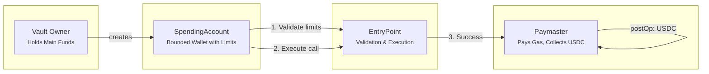

# Smart Allowance Architecture

## Flow Diagram

## Component Roles

| Component | Role |
|-----------|------|
| **Vault Owner** | EOA that holds main funds; signs UserOperations |
| **SpendingAccount** | Smart account with hard ETH/USDC limits; limits enforced before execution |
| **EntryPoint** | ERC-4337 hub; validates and executes UserOps |
| **Paymaster** | Pays gas in ETH; collects USDC from SpendingAccount (5% premium) |

## Transaction Flow

1. **Vault Owner** signs a UserOperation (execute or executeBatch).
2. **Bundler** submits the UserOp to the **EntryPoint**.
3. **EntryPoint** calls `validateUserOp` on SpendingAccount → limits checked (ETH + USDC spend + gas cost).
4. **EntryPoint** executes the call on SpendingAccount.
5. **PostOp**: Paymaster calls `payForGasInUsdc` on SpendingAccount → USDC transferred to Paymaster.
6. Paymaster is reimbursed for gas; SpendingAccount’s USDC limit is updated.

Limits are enforced **before** execution and gas payment—no bypass possible.
